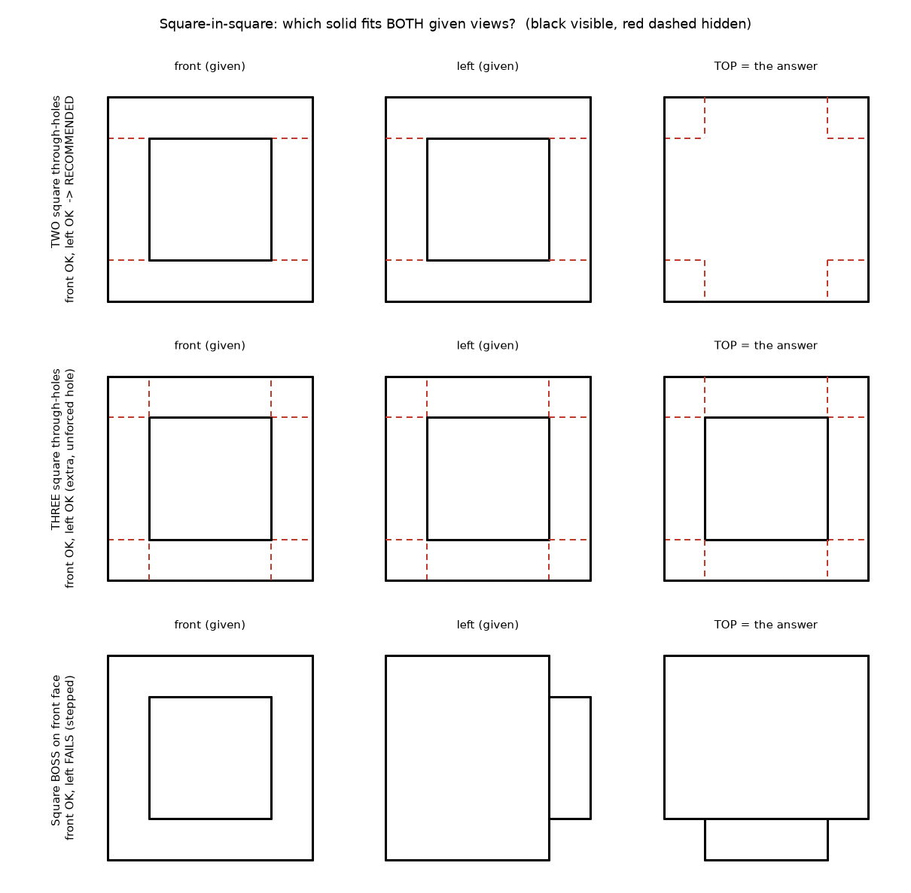

# Square-in-Square Third-View Question — Recommended Answer

Author: Beshoy Adel · Projection: first angle · Assumed sizes: A = 100 mm, B = 60 mm

## The answer

**The solid is a 100 mm block with two crossed 60 × 60 mm square through-holes:
one front-to-back and one side-to-side.**
Its top view is the outer square with the two holes' walls shown as a **hidden plus-shaped
outline**. Drawn outline-only, as the exam figure was, the top view is a **plain square**.

## Why this solid and not the others

| reading | front | left | verdict |
|---|---|---|---|
| **two square through-holes** | square in square | square in square | fits both given views |
| three square through-holes | square in square | square in square | also fits, but adds a hole that neither view calls for |
| square boss on the front face | square in square | **stepped outline** | fails the second view |
| truncated pyramid / chamfer | square in square **+ 4 corner diagonals** | **trapezoid** | fails both views, see `../Truncated-Pyramid` |

- A boss can supply only one square-in-square view. It always breaks the outline of the
  perpendicular view.
- A frustum or chamfer always draws four corner diagonals, and the neighbouring views become
  trapezoids. The exam figure had no diagonals.
- A recess is the only feature that can give a clean square-in-square in two views at once.
  One through-hole per given view is the minimum those views demand. A third hole would be
  an unforced assumption, and it would make the top view repeat the other two, which is the
  answer the interviewer rejected.

## The sentence that shows you understand the ambiguity

> "Two views never define a solid uniquely. Taking the minimum reading — one square
> through-hole for each given view — the top view is the outer square with the holes' walls
> as a hidden cross. If a third hole were intended, it would repeat the square in square."

## Correction to the earlier analysis

The earlier notes said two crossed square holes produce "a hidden hash plus diagonals". That
is wrong for square holes with aligned faces.

- The two holes **share their top and bottom faces**, so they meet along four short
  **vertical** edges. In the top view these edges collapse to points.
- The top view therefore shows a **plus-shaped hidden outline**, with **no diagonals** and no
  full `#`.
- Diagonals appear for **equal cylinders** crossing at 90° (the exam's Part 1), not for aligned
  square prisms.

## Verification

`tools/square_in_square_views.py` builds every candidate as exact geometry. All faces lie on
a 10 mm grid, so the voxel volumes are exact, and the frustum is computed as a convex hull.
It then derives every edge and its visibility per view instead of drawing them by hand.
Results are in `verification.json`.

| solid | computed volume (mm³) | expected (mm³) |
|---|---|---|
| Cube-Two-Square-Holes | 496,000 | 496,000 |
| Cube-Three-Square-Holes | 352,000 | 352,000 |
| Block-Square-Boss | 872,000 | 872,000 |
| Truncated-Pyramid | 653,333.33 | 653,333.33 |

These values confirm the analytic figures. They are **not** measurements of the SOLIDWORKS
parts in `D:\mcv`. Those still need their own `swagent verify` run.
