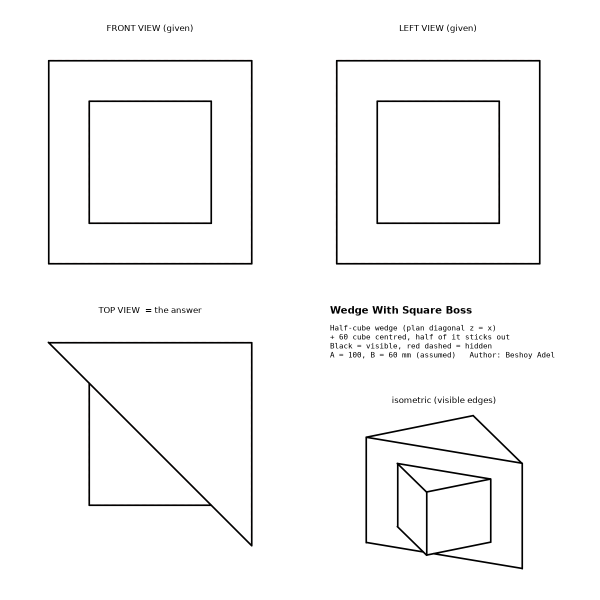
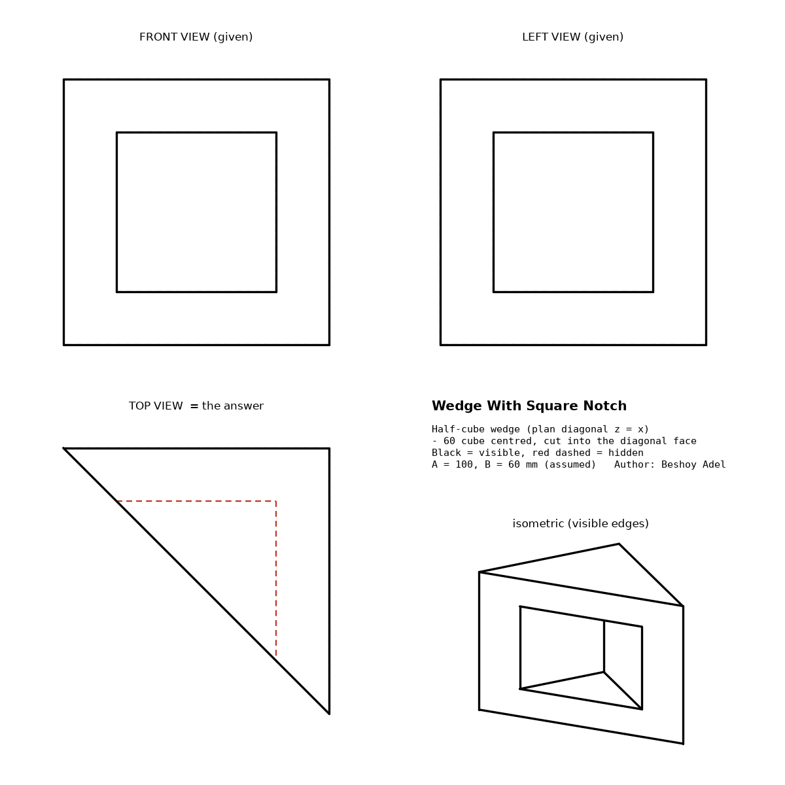

# Square-in-Square Third-View Question — Answer

Author: Beshoy Adel · Projection: first angle · Assumed sizes: A = 100 mm, B = 60 mm (only the ratio matters)

## The given

- Front view: an outer square with a concentric inner square, and nothing else.
- Left view (drawn to the right of the front view): the same.
- There are no hidden lines, no diagonals and no other lines in either view.
- The task is to find the view below the front view, which in first angle is the **top view**.

## The answer

The solid is a **half-cube wedge with a 60 mm cube centred on it**.

- The wedge is a 100 mm cube cut in half by a vertical plane. In plan, the plane runs from the
  front-right vertical edge to the back-left vertical edge. The half that is kept is the
  back-right half, so the sloping face looks toward the front **and** toward the left.
- The 60 mm cube sits at the centre, and the sloping face passes through its middle.
  - **Extrude version:** add the cube. Half of it sticks out of the sloping face.
  - **Hole version:** cut the cube out. This leaves a square notch in the sloping face.

These two versions are exactly what the interviewer said: "not a cube", and "something with a
hole or an extrude".

**The top view is a right triangle, which is half of the 100 square with its hypotenuse on
the diagonal.**

- Extrude version: a small visible triangle stands out from the hypotenuse, made of the
  cube's two outer edges.
- Hole version: the notch appears inside the triangle as two hidden (dashed) lines.

| Extrude (boss) | Hole (notch) |
|---|---|
|  |  |

## Why the front and left views show only two squares

- The outer square in both views is the silhouette of the wedge. The wedge has vertical edges
  only at three corners of the 100 square, and they fall on the outer square in both views.
- The sloping face is vertical and it faces both viewers. In each view it shows as a plain
  area with no lines on it.
- The inner square is the cube's face that looks toward the viewer:
  - in the extrude version, the protruding front face and the protruding left face;
  - in the hole version, the notch's back wall and its right wall.
  
  Nothing stands in front of these faces, so all four sides of the inner square are visible.
- Every other edge falls exactly on one of the two squares, so no extra or dashed line
  appears.

## Why the other readings are wrong

Each candidate was built as an exact solid and passed through OpenCascade hidden-line removal
(`tools/strict_views.py`). The test passes only when the front and left views each contain
exactly the two squares: no extra line, no missing line and no visible dashed line.

| candidate | front | left | reason |
|---|---|---|---|
| **wedge + 60 cube (extrude)** | **pass** | **pass** | exactly two squares |
| **wedge − 60 cube (hole)** | **pass** | **pass** | exactly two squares |
| cube with two crossed square through-holes | fail | fail | adds dashed lines at the inner square's level |
| cube with three square through-holes | fail | fail | adds more dashed lines |
| block with a square boss on the front | pass | fail | the left view becomes a stepped outline |
| truncated pyramid / chamfer | fail | fail | adds 4 corner diagonals, and the other view is a trapezoid |

The same program measured every solid. All of them are valid solids with a 100 × 100 × 100 mm
bounding box. The values are in `verification.json`.

| solid | volume (mm³) |
|---|---|
| wedge + cube | 608,000 = 500,000 + 216,000 / 2 |
| wedge − cube | 392,000 = 500,000 − 216,000 / 2 |

## How to build it in SOLIDWORKS

1. Top Plane: sketch a right triangle with 100 mm legs, and put its hypotenuse on the square's
   diagonal from front-right to back-left, keeping the back-right half. Extrude it Mid Plane,
   100 mm.
2. Top Plane: sketch a 60 mm centred square. Extrude it Mid Plane, 60 mm, as either a **Boss**
   (extrude version) or a **Cut** (hole version).
3. Check the result: the volume should be 608,000 mm³ for the boss or 392,000 mm³ for the cut.
   The STEP files are in each part folder for comparison.

## What to say in the interview

> "Two views never fix a solid on their own. Here both views are only two squares with no
> hidden lines, so the inner square must be a face that looks at the front and at the side
> at the same time. That points to a wedge cut on the plan diagonal, with a square cube
> extruded out of it or cut into it. So the top view is a right triangle, with the cube
> showing as a small triangle outside it for the extrude, or as dashed lines inside it for
> the hole."

Note: under third-angle projection the side view on the right is the right view, so the wedge
and the top view would be mirrored.
